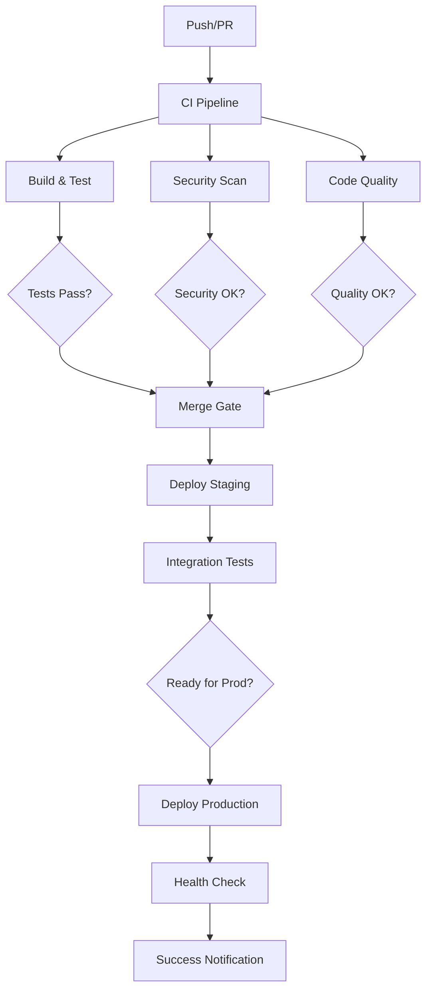

# CI/CD Workflows Documentation

This document provides comprehensive guidance for setting up CI/CD workflows for Spin-Torque RL-Gym.

> **Note**: Due to GitHub App permission limitations, workflow files must be manually created by repository maintainers using the templates provided in the `examples/` directory.

## Overview

The CI/CD strategy implements a comprehensive SDLC approach with:

- **Continuous Integration**: Automated testing, linting, security scanning
- **Continuous Deployment**: Automated deployment to staging and production
- **Security Integration**: SLSA compliance, SBOM generation, vulnerability scanning
- **Quality Gates**: Code coverage, performance benchmarks, manual approvals
- **Dependency Management**: Automated updates with security validation

## Workflow Architecture



## Required Workflows

### 1. Pull Request Validation (`ci.yml`)

**Purpose**: Validate all pull requests with comprehensive testing and quality checks.

**Triggers**:
- Pull request opened, synchronized, reopened
- Manual workflow dispatch

**Jobs**:
- **Build and Test**: Multi-platform testing (Ubuntu, macOS, Windows)
- **Code Quality**: Linting, formatting, type checking
- **Security Scan**: SAST, dependency scanning, secrets detection
- **Performance Tests**: Benchmark regression testing
- **Documentation**: Validate docs build and links

**Matrix Strategy**:
```yaml
strategy:
  matrix:
    os: [ubuntu-latest, macos-latest, windows-latest]
    python-version: ['3.8', '3.9', '3.10', '3.11']
    include:
      - os: ubuntu-latest
        python-version: '3.11'
        coverage: true
```

### 2. Continuous Deployment (`cd.yml`)

**Purpose**: Automated deployment pipeline for staging and production environments.

**Triggers**:
- Push to main branch
- Release created
- Manual workflow dispatch with environment selection

**Jobs**:
- **Build Artifacts**: Create container images with semantic versioning
- **Deploy Staging**: Automatic deployment to staging environment
- **Integration Tests**: Full end-to-end testing in staging
- **Deploy Production**: Manual approval gate for production deployment
- **Health Monitoring**: Post-deployment health verification

### 3. Security Scanning (`security-scan.yml`)

**Purpose**: Comprehensive security scanning and compliance validation.

**Triggers**:
- Schedule: Daily at 02:00 UTC
- Push to main branch
- Manual workflow dispatch

**Jobs**:
- **SAST Scanning**: Static application security testing with CodeQL
- **Dependency Scanning**: Vulnerability scanning with Snyk/Dependabot
- **Container Scanning**: Docker image vulnerability assessment
- **Secrets Detection**: Scan for accidentally committed secrets
- **SLSA Provenance**: Generate SLSA Level 3 provenance attestation
- **SBOM Generation**: Create Software Bill of Materials

### 4. Dependency Updates (`dependency-update.yml`)

**Purpose**: Automated dependency management with security validation.

**Triggers**:
- Schedule: Weekly on Mondays at 08:00 UTC
- Manual workflow dispatch

**Jobs**:
- **Dependency Analysis**: Identify outdated dependencies
- **Security Assessment**: Check for known vulnerabilities
- **Automated Updates**: Create PRs for safe updates
- **Test Validation**: Run full test suite on updates
- **Merge Automation**: Auto-merge if all checks pass

## Workflow Templates

### CI Pipeline Template

```yaml
# .github/workflows/ci.yml
name: Continuous Integration

on:
  pull_request:
    branches: [ main, develop ]
  push:
    branches: [ main, develop ]
  workflow_dispatch:

env:
  REGISTRY: ghcr.io
  IMAGE_NAME: ${{ github.repository }}

jobs:
  test:
    name: Test Suite
    runs-on: ${{ matrix.os }}
    
    strategy:
      matrix:
        os: [ubuntu-latest, macos-latest, windows-latest]
        python-version: ['3.8', '3.9', '3.10', '3.11']
        include:
          - os: ubuntu-latest
            python-version: '3.11'
            coverage: true
    
    steps:
    - name: Checkout code
      uses: actions/checkout@v4
      with:
        fetch-depth: 0
    
    - name: Set up Python ${{ matrix.python-version }}
      uses: actions/setup-python@v4
      with:
        python-version: ${{ matrix.python-version }}
        cache: 'pip'
    
    - name: Install dependencies
      run: |
        python -m pip install --upgrade pip
        pip install -e ".[dev,jax,viz]"
    
    - name: Run tests
      run: |
        pytest tests/ -v --tb=short --maxfail=10
        
    - name: Run coverage (Ubuntu + Python 3.11 only)
      if: matrix.coverage
      run: |
        pytest tests/ --cov=spin_torque_gym --cov-report=xml --cov-report=term-missing
        
    - name: Upload coverage to Codecov
      if: matrix.coverage
      uses: codecov/codecov-action@v3
      with:
        file: ./coverage.xml
        fail_ci_if_error: true

  lint:
    name: Code Quality
    runs-on: ubuntu-latest
    
    steps:
    - name: Checkout code
      uses: actions/checkout@v4
    
    - name: Set up Python
      uses: actions/setup-python@v4
      with:
        python-version: '3.11'
        cache: 'pip'
    
    - name: Install dependencies
      run: |
        python -m pip install --upgrade pip
        pip install -e ".[dev]"
    
    - name: Run ruff
      run: ruff check spin_torque_gym/ tests/ --output-format=github
      
    - name: Run black
      run: black --check spin_torque_gym/ tests/
      
    - name: Run isort
      run: isort --check-only spin_torque_gym/ tests/
      
    - name: Run mypy
      run: mypy spin_torque_gym/

  security:
    name: Security Scan
    runs-on: ubuntu-latest
    
    steps:
    - name: Checkout code
      uses: actions/checkout@v4
    
    - name: Set up Python
      uses: actions/setup-python@v4
      with:
        python-version: '3.11'
    
    - name: Install dependencies
      run: |
        python -m pip install --upgrade pip
        pip install -e ".[dev]"
    
    - name: Run bandit
      run: bandit -r spin_torque_gym/ -f json -o bandit-report.json
      continue-on-error: true
    
    - name: Run safety
      run: safety check --json --output safety-report.json
      continue-on-error: true
    
    - name: Upload security reports
      uses: actions/upload-artifact@v3
      with:
        name: security-reports
        path: |
          bandit-report.json
          safety-report.json

  build:
    name: Build Container
    runs-on: ubuntu-latest
    needs: [test, lint, security]
    
    steps:
    - name: Checkout code
      uses: actions/checkout@v4
    
    - name: Set up Docker Buildx
      uses: docker/setup-buildx-action@v3
    
    - name: Log in to Container Registry
      uses: docker/login-action@v3
      with:
        registry: ${{ env.REGISTRY }}
        username: ${{ github.actor }}
        password: ${{ secrets.GITHUB_TOKEN }}
    
    - name: Extract metadata
      id: meta
      uses: docker/metadata-action@v5
      with:
        images: ${{ env.REGISTRY }}/${{ env.IMAGE_NAME }}
        tags: |
          type=ref,event=branch
          type=ref,event=pr
          type=semver,pattern={{version}}
          type=semver,pattern={{major}}.{{minor}}
    
    - name: Build and push
      uses: docker/build-push-action@v5
      with:
        context: .
        target: production
        platforms: linux/amd64,linux/arm64
        push: true
        tags: ${{ steps.meta.outputs.tags }}
        labels: ${{ steps.meta.outputs.labels }}
        cache-from: type=gha
        cache-to: type=gha,mode=max
```

### CD Pipeline Template

```yaml
# .github/workflows/cd.yml
name: Continuous Deployment

on:
  push:
    branches: [ main ]
  release:
    types: [ created ]
  workflow_dispatch:
    inputs:
      environment:
        description: 'Deployment environment'
        required: true
        default: 'staging'
        type: choice
        options:
        - staging
        - production

env:
  REGISTRY: ghcr.io
  IMAGE_NAME: ${{ github.repository }}

jobs:
  build:
    name: Build Release Artifacts
    runs-on: ubuntu-latest
    
    outputs:
      image-digest: ${{ steps.build.outputs.digest }}
      image-url: ${{ steps.build.outputs.image-url }}
    
    steps:
    - name: Checkout code
      uses: actions/checkout@v4
      with:
        fetch-depth: 0
    
    - name: Set up Docker Buildx
      uses: docker/setup-buildx-action@v3
    
    - name: Log in to Container Registry
      uses: docker/login-action@v3
      with:
        registry: ${{ env.REGISTRY }}
        username: ${{ github.actor }}
        password: ${{ secrets.GITHUB_TOKEN }}
    
    - name: Generate version
      id: version
      run: |
        if [[ ${{ github.event_name }} == 'release' ]]; then
          echo "version=${{ github.event.release.tag_name }}" >> $GITHUB_OUTPUT
        else
          echo "version=${GITHUB_SHA::8}" >> $GITHUB_OUTPUT
        fi
    
    - name: Build and push
      id: build
      uses: docker/build-push-action@v5
      with:
        context: .
        target: production
        platforms: linux/amd64,linux/arm64
        push: true
        tags: |
          ${{ env.REGISTRY }}/${{ env.IMAGE_NAME }}:${{ steps.version.outputs.version }}
          ${{ env.REGISTRY }}/${{ env.IMAGE_NAME }}:latest
        build-args: |
          VERSION=${{ steps.version.outputs.version }}
          BUILD_DATE=${{ github.run_id }}
          VCS_REF=${{ github.sha }}
        cache-from: type=gha
        cache-to: type=gha,mode=max

  deploy-staging:
    name: Deploy to Staging
    runs-on: ubuntu-latest
    needs: build
    environment: staging
    
    steps:
    - name: Checkout code
      uses: actions/checkout@v4
    
    - name: Deploy to staging
      run: |
        echo "Deploying to staging environment..."
        # Add actual deployment commands here
        # e.g., kubectl apply, docker-compose up, etc.
    
    - name: Run integration tests
      run: |
        echo "Running integration tests..."
        # Add integration test commands
    
    - name: Health check
      run: |
        echo "Performing health check..."
        curl -f ${{ secrets.STAGING_URL }}/health

  deploy-production:
    name: Deploy to Production
    runs-on: ubuntu-latest
    needs: [build, deploy-staging]
    environment: production
    if: github.event_name == 'release' || (github.event_name == 'workflow_dispatch' && github.event.inputs.environment == 'production')
    
    steps:
    - name: Checkout code
      uses: actions/checkout@v4
    
    - name: Deploy to production
      run: |
        echo "Deploying to production environment..."
        # Add actual deployment commands here
    
    - name: Health check
      run: |
        echo "Performing production health check..."
        curl -f ${{ secrets.PRODUCTION_URL }}/health
    
    - name: Notify deployment
      uses: 8398a7/action-slack@v3
      with:
        status: success
        text: 'Production deployment successful! 🚀'
      env:
        SLACK_WEBHOOK_URL: ${{ secrets.SLACK_WEBHOOK }}
```

### Security Scanning Template

```yaml
# .github/workflows/security-scan.yml
name: Security Scanning

on:
  schedule:
    - cron: '0 2 * * *'  # Daily at 2 AM UTC
  push:
    branches: [ main ]
  workflow_dispatch:

jobs:
  codeql:
    name: CodeQL Analysis
    runs-on: ubuntu-latest
    
    strategy:
      matrix:
        language: [ 'python' ]
    
    steps:
    - name: Checkout code
      uses: actions/checkout@v4
    
    - name: Initialize CodeQL
      uses: github/codeql-action/init@v2
      with:
        languages: ${{ matrix.language }}
    
    - name: Autobuild
      uses: github/codeql-action/autobuild@v2
    
    - name: Perform CodeQL Analysis
      uses: github/codeql-action/analyze@v2

  dependency-scan:
    name: Dependency Vulnerability Scan
    runs-on: ubuntu-latest
    
    steps:
    - name: Checkout code
      uses: actions/checkout@v4
    
    - name: Set up Python
      uses: actions/setup-python@v4
      with:
        python-version: '3.11'
    
    - name: Install dependencies
      run: |
        python -m pip install --upgrade pip
        pip install -e ".[dev]"
    
    - name: Run Snyk
      uses: snyk/actions/python@master
      env:
        SNYK_TOKEN: ${{ secrets.SNYK_TOKEN }}
      with:
        args: --severity-threshold=medium
    
    - name: Generate SBOM
      uses: anchore/sbom-action@v0
      with:
        path: .
        format: spdx-json
        output-file: sbom.spdx.json
    
    - name: Upload SBOM
      uses: actions/upload-artifact@v3
      with:
        name: sbom
        path: sbom.spdx.json

  container-scan:
    name: Container Security Scan
    runs-on: ubuntu-latest
    
    steps:
    - name: Checkout code
      uses: actions/checkout@v4
    
    - name: Build image for scanning
      run: |
        docker build -t scan-image:latest .
    
    - name: Run Trivy scanner
      uses: aquasecurity/trivy-action@master
      with:
        image-ref: 'scan-image:latest'
        format: 'sarif'
        output: 'trivy-results.sarif'
    
    - name: Upload Trivy scan results
      uses: github/codeql-action/upload-sarif@v2
      with:
        sarif_file: 'trivy-results.sarif'

  secrets-scan:
    name: Secrets Detection
    runs-on: ubuntu-latest
    
    steps:
    - name: Checkout code
      uses: actions/checkout@v4
      with:
        fetch-depth: 0
    
    - name: TruffleHog OSS
      uses: trufflesecurity/trufflehog@main
      with:
        path: ./
        base: main
        head: HEAD
```

## Environment Configuration

### Staging Environment

**Purpose**: Integration testing and pre-production validation

**Configuration**:
- Automatic deployment from main branch
- Integration test execution
- Performance benchmarking
- Security validation

**Required Secrets**:
- `STAGING_URL`: Staging environment URL
- `STAGING_DB_URL`: Staging database connection
- `STAGING_DEPLOY_KEY`: SSH key for deployment

### Production Environment

**Purpose**: Live production system

**Configuration**:
- Manual approval required
- Health checks and monitoring
- Rollback capabilities
- Success notifications

**Required Secrets**:
- `PRODUCTION_URL`: Production environment URL
- `PRODUCTION_DB_URL`: Production database connection
- `PRODUCTION_DEPLOY_KEY`: SSH key for deployment
- `SLACK_WEBHOOK`: Slack notifications

## Security Integration

### SLSA Compliance

The workflows implement SLSA (Supply-chain Levels for Software Artifacts) Level 3 compliance:

1. **Source Integrity**: Code signing and verification
2. **Build Integrity**: Hermetic, reproducible builds
3. **Provenance**: Cryptographically signed build attestations
4. **Isolation**: Build isolation from external influences

### SBOM Generation

Software Bill of Materials (SBOM) is generated for:
- Direct dependencies
- Transitive dependencies
- Container base images
- System packages

### Vulnerability Management

Automated vulnerability scanning includes:
- Source code analysis (SAST)
- Dependency vulnerability scanning
- Container image scanning
- Infrastructure as Code scanning

## Monitoring and Observability

### Build Metrics

Key metrics tracked:
- Build duration and success rate
- Test execution time and coverage
- Security scan results
- Deployment frequency and success rate

### Alerting

Automated alerts for:
- Build failures
- Security vulnerabilities
- Deployment failures
- Performance regressions

## Manual Setup Instructions

### Step 1: Create Workflow Files

Repository maintainers must manually create the following files:

```bash
mkdir -p .github/workflows
cp docs/workflows/examples/ci.yml .github/workflows/
cp docs/workflows/examples/cd.yml .github/workflows/
cp docs/workflows/examples/security-scan.yml .github/workflows/
cp docs/workflows/examples/dependency-update.yml .github/workflows/
```

### Step 2: Configure Secrets

Add the following secrets in GitHub repository settings:

**Required for all workflows**:
- `GITHUB_TOKEN`: Automatically provided by GitHub

**Required for deployment**:
- `STAGING_URL`: https://staging.spinrl.com
- `PRODUCTION_URL`: https://spinrl.com
- `SLACK_WEBHOOK`: Slack webhook URL for notifications

**Optional for enhanced security**:
- `SNYK_TOKEN`: Snyk API token for vulnerability scanning
- `CODECOV_TOKEN`: Codecov token for coverage reporting

### Step 3: Configure Environments

Create environments in GitHub repository settings:

1. **staging**: Automatic deployment, no approval required
2. **production**: Manual approval required, restricted to main branch

### Step 4: Enable Branch Protection

Configure branch protection rules for main branch:
- Require status checks to pass
- Require branches to be up to date
- Require review from code owners
- Restrict pushes to main branch

### Step 5: Configure Dependabot

Create `.github/dependabot.yml`:

```yaml
version: 2
updates:
  - package-ecosystem: "pip"
    directory: "/"
    schedule:
      interval: "weekly"
    open-pull-requests-limit: 10
  
  - package-ecosystem: "docker"
    directory: "/"
    schedule:
      interval: "weekly"
  
  - package-ecosystem: "github-actions"
    directory: "/"
    schedule:
      interval: "weekly"
```

## Troubleshooting

### Common Issues

1. **Workflow not triggering**
   - Check trigger conditions
   - Verify branch names match configuration
   - Check if workflow file syntax is valid

2. **Build failures**
   - Review build logs for specific errors
   - Check dependency compatibility
   - Verify environment variables

3. **Deployment failures**
   - Check deployment target availability
   - Verify credentials and permissions
   - Review infrastructure configuration

4. **Security scan failures**
   - Review vulnerability reports
   - Update dependencies if needed
   - Add security exceptions if false positives

### Best Practices

1. **Workflow Design**
   - Keep workflows focused and modular
   - Use reusable actions and workflows
   - Implement proper error handling

2. **Security**
   - Never hardcode secrets in workflows
   - Use least privilege access
   - Regularly rotate secrets and tokens

3. **Performance**
   - Use caching for dependencies
   - Parallelize independent jobs
   - Optimize Docker builds with multi-stage

4. **Maintenance**
   - Regularly update action versions
   - Monitor workflow performance
   - Review and update security policies

This documentation provides the foundation for implementing a robust CI/CD pipeline. Repository maintainers should customize the templates based on specific deployment requirements and infrastructure setup.